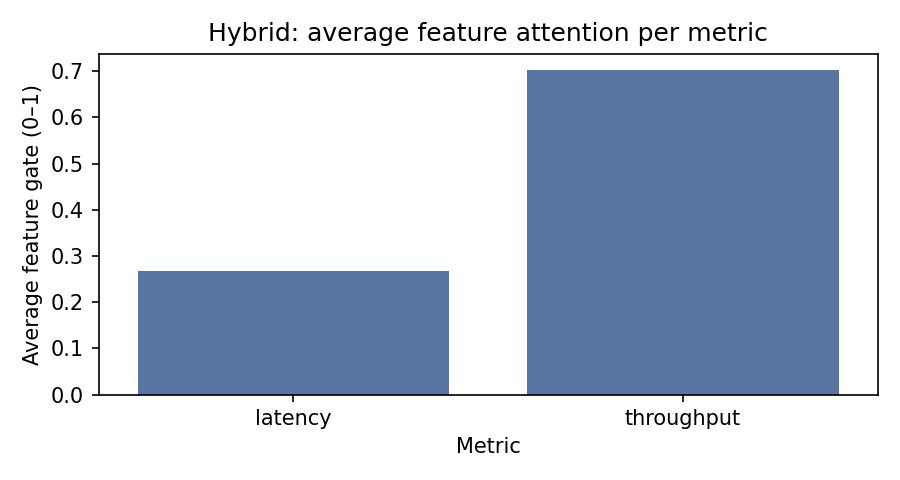
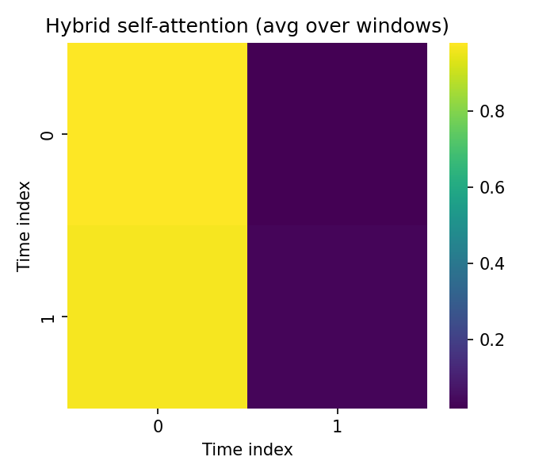

# Hybrid Model Results

Window-level evaluation on the held-out test cluster (A→B):

| Metric | Value |
|---|---:|
| precision | 0.0210 |
| recall | 1.0000 |
| f1 | 0.0411 |
| auroc | 0.5435 |
| accuracy | 0.0210 |
| precision_at_recall_0_80 | 0.0233 |
| time_to_alert_min | 0.0000 |

Baseline disk-level metrics (from metrics_summary.csv, not directly comparable to window-level):

| Model | N | Precision | Recall | F1 | Accuracy |
|---|---:|---:|---:|---:|---:|
| autoencoder_A | 0 | 0.000 | 0.000 | 0.000 | 0.000 |
| autoencoder_B | 0 | 0.000 | 0.000 | 0.000 | 0.000 |
| csr_A | 2 | 1.000 | 1.000 | 1.000 | 1.000 |
| csr_B | 2 | 1.000 | 1.000 | 1.000 | 1.000 |
| hybrid | 0 | 0.000 | 0.000 | 0.000 | 0.000 |
| iforest_A | 0 | 0.000 | 0.000 | 0.000 | 0.000 |
| iforest_B | 0 | 0.000 | 0.000 | 0.000 | 0.000 |
| lstm | 24 | 0.000 | 0.000 | 0.000 | 0.917 |
| multi_pred_A | 2 | 0.000 | 0.000 | 0.000 | 0.000 |
| multi_pred_B | 2 | 0.000 | 0.000 | 0.000 | 0.000 |
| patchTST | 24 | 0.000 | 0.000 | 0.000 | 0.917 |
| svm_A | 0 | 0.000 | 0.000 | 0.000 | 0.000 |
| svm_B | 0 | 0.000 | 0.000 | 0.000 | 0.000 |
| iforest_output | 94 | 0.000 | 0.000 | 0.000 | 0.947 |
| svm_output | 94 | 0.000 | 0.000 | 0.000 | 0.628 |

Note: Hybrid metrics are window-level; summary baselines are disk-level from parse_results and are included for context only.

